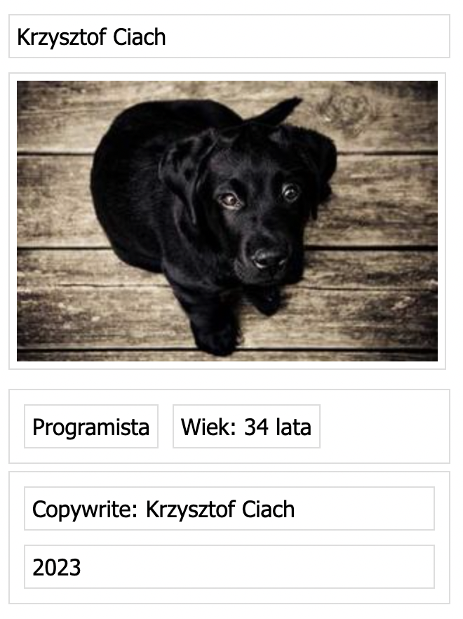

## Builder - exercise 1

Implement small application to transform [text](./input.ts) representing tree-like data to JSON or DOM Elements (potentially others). Use builder pattern to implement it. Text document parsers is implemented - [parser.ts](./parser.ts).

```
  text(Krzysztof Ciach)
  img(https://picsum.photos/id/237/300/200)
  block(row)
    text(Programista)
    text(Wiek: 34 lata)
  block(column)
    text(Copywrite: Krzysztof Ciach)
    text(2023)
```

It would be transformed to something similar like:

### JSON:

```
{
  "children":[
    {
      "type":"text",
      "value":"Krzysztof Ciach"
    },
    {
      "type":"img",
      "value":"https://picsum.photos/id/237/300/200"
    },
    {
      "type":"block",
      "value":"row",
      "children":[
        {
          "type":"text",
          "value":"Programista"
        },
        {
          "type":"text",
          "value":"Wiek: 34 lata"
        }
      ]
    },
    {
      "type":"block",
      "value":"column",
      "children":[
        {
          "type":"text",
          "value":"Copywrite: Krzysztof Ciach"
        },
        {
          "type":"text",
          "value":"2023"
        }
      ]
    }
  ]
}
```

### Appened to html document DOM Elements



It doesn't has to be exactly like. The most imporant is structure of elements.
