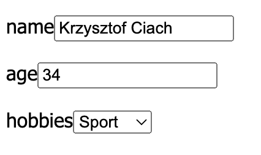
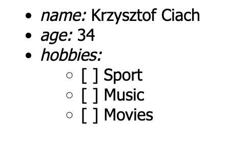
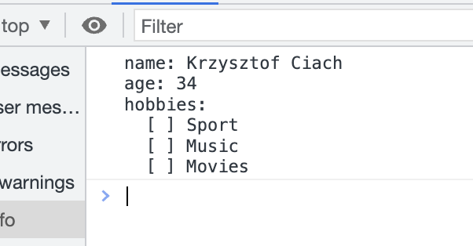

## Builder - exercise 2

Implement small application that build form dynamicly.

### Requirments

- this application generates the same forms in text-only or non-interactive-html way.
- for simplifying let's assume that form can only have: text, choice-list and label for them.

### Example results

#### UI Form

#### HTML Non-interactive Form

#### String Form

